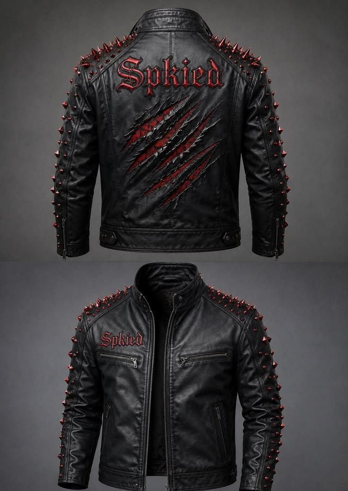

# Kaptan Leather

A full-stack storefront for **Kaptan Leather** — premium leather jackets, track-grade
racing suits and sublimated combat sportswear. Built with **Next.js 14 (App Router)**,
**TypeScript**, **Tailwind CSS** and **Framer Motion**, and ready to deploy to **Vercel**.



## Features

- **Storefront** — animated hero with parallax, collection grid, featured drops,
  editorial section, scroll reveals, hover image-swaps and a sticky glass navbar.
- **Catalogue** — 33 products across 4 categories, all priced in **£ (GBP)**, with
  filtering and sorting.
- **Cart & checkout** — slide-in cart drawer, free-shipping progress bar, full cart
  page, a multi-step checkout form and an animated order-confirmation page.
  Checkout is a **mock flow** (no real payment is taken).
- **Admin panel** (`/admin`) — password-protected dashboard to **add / edit / delete
  products**, manage **order statuses**, and view revenue / stock stats. Includes a
  visual image picker that reads from `public/products`.
- **Footer** — the registered **Companies House** details for Kaptan Leather.

## Getting started (local)

```bash
npm install
npm run dev
```

Open <http://localhost:3000>.

- Storefront: `/`
- Admin: `/admin` → log in with the password in `.env.local`
  (default **`kaptan2025`**).

### Environment variables

Copy `.env.example` to `.env.local` (a working `.env.local` is already included for
local dev):

| Variable             | Purpose                                                        |
| -------------------- | ------------------------------------------------------------- |
| `ADMIN_PASSWORD`     | Password for the `/admin` login.                              |
| `SESSION_SECRET`     | Secret used to sign the admin session cookie (long & random). |
| `KV_REST_API_URL`    | Redis/KV REST URL (provided by Vercel — leave blank locally). |
| `KV_REST_API_TOKEN`  | Redis/KV REST token (provided by Vercel — leave blank locally).|

## Data storage

The app uses a small storage adapter (`lib/store.ts`):

- **Locally** (no KV env vars) → product & order data is stored in JSON files under
  `/.data`, so the admin panel is fully functional during development.
- **On Vercel** → connect a **Redis (KV)** integration and the same data is stored in
  Upstash Redis over its REST API. No SDK is used, so it is unaffected by the
  `@vercel/kv` deprecation and works with any Vercel Marketplace Redis store.

The product catalogue **seeds automatically** on first run.

## Deploy to Vercel

1. Push this folder to a Git repository (GitHub/GitLab/Bitbucket).
2. In Vercel, **Add New → Project** and import the repo. Framework preset:
   **Next.js** (auto-detected). No build settings to change.
3. Under **Storage**, add a **Redis** (KV) integration and connect it to the project.
   Vercel injects `KV_REST_API_URL` and `KV_REST_API_TOKEN` automatically.
4. Under **Settings → Environment Variables**, add:
   - `ADMIN_PASSWORD` — your real admin password
   - `SESSION_SECRET` — a long random string
5. **Deploy**. Admin product/order edits will now persist in Redis.

> Without the Redis integration the site still deploys and runs, but because Vercel's
> filesystem is read-only at runtime, admin edits won't persist between requests — add
> the integration for a live, editable store.

## Project structure

```
app/
  (store)/            storefront route group (navbar + footer + cart)
    page.tsx          home
    shop/             listing + category pages
    product/[slug]/   product detail
    cart, checkout/   cart, checkout, success
  admin/              login + protected dashboard
  api/                products, orders, admin auth, asset list
components/           navbar, footer, cart, product card/view, admin UI, motion bits
lib/                  types, seed catalogue, storage adapter, auth, utils
public/products/      product photography
middleware.ts         protects /admin
```

## Adding / editing products

Go to `/admin`, log in, and use **Add product** or **Edit**. To use new photography,
drop image files into `public/products/` — they appear automatically in the editor's
image picker.

---

© Kaptan Leather Ltd. Registered in England & Wales.
